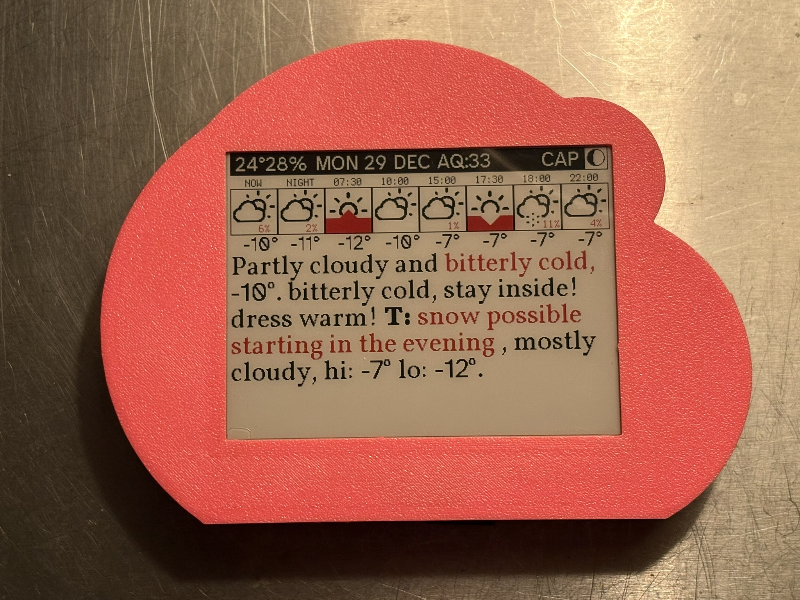
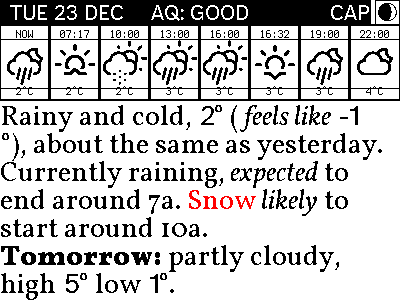

# pinkweather

yet another weather display for e-ink; does indoor temp + humidity and weather forecast from open-meteo.com (openweathermap.org) api + severe alertz from weatherbit.io api, runs on a pico 2w micro-controller, in a lil' pink cloud i 3d printed. mostly a spaghetti-monster-mash of python code that claude ai helped me write 🥺





### 0. Microcontroller Usage

**DEPLOY:**

this will use rsync to copy (sync) files from 300x400/CIRCUITPY/ to the mounted usb CIRCUITPY disk

```bash
make deploy
```

### 1. Devel

**Option 1: Using make**
```bash
make install        # Basic installation
make activate
```

**Option 3: Virtual environment (recommended)**
```bash
# Create virtual environment
python -m venv venv

# Activate it
source venv/bin/activate 

# Install dependencies
pip install -r requirements.txt
```

### 2. Development Preview Server

Start the web development server to design and test layouts:

```bash
make server
```

Then open http://localhost:8000 in yr browser.

## generate static dataset (for some broad analysis)

```sh
make generate-dataset

# or if in a hurry
make generate-dataset csv-only

# or if only like 100
make generate-dataset 100

# or if only like 100 in csv
make generate-dataset csv-only 100
```

then see output in: `preview/static/`


## font stuff

convert some `.ttf` font file to `.bdf` like:

```sh
otf2bdf googz/Barlow_Condensed/BarlowCondensed-Regular.ttf -p 30 -o barlowcond30.bdf

otf2bdf googz/Barlow_Condensed/BarlowCondensed-Regular.ttf -p 60 -o barlowcond60.bdf
```

then use https://adafruit.github.io/web-bdftopcf/ to convert this `.bdf` to a `.pcf` file

## HARDWARE

- [Raspberry Pi Pico 2W](https://www.adafruit.com/product/6087)
- [Adafruit 2.13" Tri-Color eInk Display (SSD1680)](https://www.adafruit.com/product/6382)
- [Adafruit HDC3022 Precision Temperature & Humidity Sensor](https://www.adafruit.com/product/5989)
- [Magnetic Connector](https://www.adafruit.com/product/5360)


## Weather API Integration

### API

1. Sign up at https://openweathermap.org/api & https://www.weatherbit.io/
2. Get API key
3. Update `config.py` with API keys:

### some handy-dandy Makefile scriptz

```bash
make install          # Install basic dependencies
make server           # Start development web server
make preview          # Generate weather display preview
make deploy           # Deploy code to CIRCUITPY device
make generate-dataset # [DATASET] [csv-only] [COUNT] - Generate dataset (csv-only for fast iteration)
                 # Available datasets: ny_2024 (default), toronto_2025
                 # Examples: make generate-dataset toronto_2025 csv-only 50
                 #           make generate-dataset ny_2024 100
make generate-images # [COUNT] - Generate images for existing narratives_*.csv
                 # Images saved to images/DATASET/ directories (e.g. images/nyc_2024/)
make venv             # Create virtual environment
make activate         # Show how to activate virtual environment
```

---

made with ⛈️ in NYC
